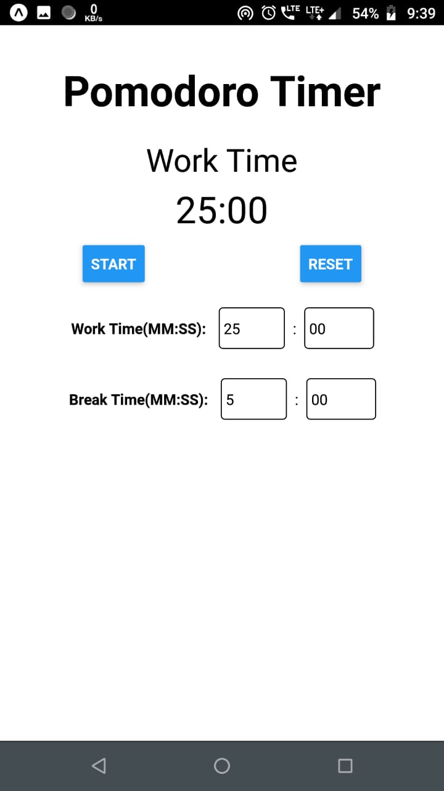

  

# Pomodoro Timer

**Pomodoro Timer** is a React Native timer app 📱 based on the [Pomodoro Technique](https://en.wikipedia.org/wiki/Pomodoro_Technique). I started my React Native journey with this app. Long road ahead! 🛣️

## Inspiration
Inspiration for this app is taken from [CS50's Mobile App Development with React Native](https://courses.edx.org/courses/course-v1:HarvardX+CS50M+Mobile/course/)

## Screenshot

<table style="width:100%" align="center">
  <tr>
    <!-- <th>Splash Screen</th> -->
    <th>Home Screen</th>
  </tr>
  <tr>
    <!-- <td></td> -->
    <td></td>
  </tr>
</table>

## About
- It is a simple timer app.
- It is based on [Pomodoro Technique](https://en.wikipedia.org/wiki/Pomodoro_Technique).
- User can change Work Time and Break Time as they wish.

## Built With 🛠
- [React Native](https://reactnative.dev/) - React Native combines the best parts of native development with React, a best-in-class JavaScript library for building user interfaces.
